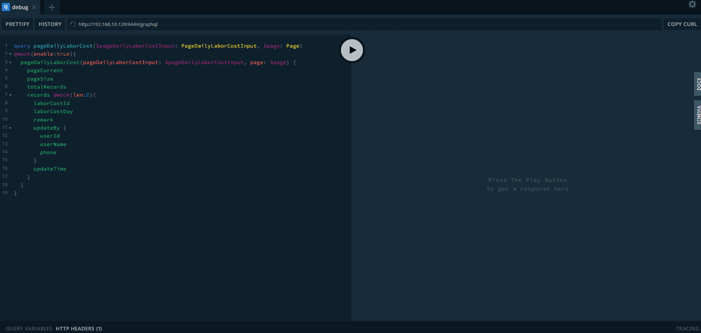

# 配置

运行 yarn qiufen init 后，您将获得一个 qiufen.config.js 文件。

## port

- 类型：number
- 是否可选：否

配置您的 gk 服务端口

示例：

```js
{
  port: 9444;
}
```

## endpoint

- 类型：{ url: string }
- 是否可选：否

配置后端服务

示例：

```js
{
  endpoint: {
    url: 'http://192.168.10.233:9409/graphql-web',
  },
}
```

## localSchemaFile

- 类型：string
- 是否可选：是

本地 graphql schema 文件路径，当后端服务不可用时，配置此项并将 schemaPolicy 设为'local'将启用此本地模式

示例：

```js
{
    localSchemaFile：path.join(__dirname, './src/graphql/generated/schema.graphql')
}
```

## schemaPolicy

- 类型：'local' | 'remote'
- 是否可选：是

使用本地模式或远程模式，如果未设置，将使用远程模式

示例：

```js
{
  schemaPolicy: 'remote';
}
```

## mock

- 类型：MockConfig
- 是否可选：是

```js
interface MockConfig {
  /** 在true情况下启用mock */
  enable: boolean
  /** 启用mock指令，默认值为true */
  mockDirectiveDefaultEnableValue: boolean
  /** 配置开发环境的schema文件路径，当enable为true时有效 （使用场景：当后端未定义接口时，前端可先自定义schema文件，实现提前开发）*/
  schemaFiles?: string[]
  /**值映射规则，您应该在此处添加所有类型映射值，否则会出错 */
  scalarMap: IMockOptions['mocks']
  /** mock指令中mock脚本的上下文 */
  context?: Record<string, unknown>
  /** 用于操作的graphql解析器，您可以在此处自定义操作响应 */
  resolvers?: IMockOptions['resolvers']
}
```

### scalarMap

```javascript
{
  scalarMap: {
    Int: () => Random.integer(0, 100),
    String: () => Random.ctitle(2, 4),
    ID: () => Random.id(),
    Boolean: () => Random.boolean(),
    BigDecimal: () => Random.integer(0, 1000000),
    Float: () => Random.float(0, 100),
    Date: () => Random.date(),
    Long: () => Random.integer(0, 10000),
    NumberOrBoolOrStringOrNull: () => null,
    NumberOrString: () => null,
  },
}
```

### context

```js
{
  context: {
    customer: {
      name: ['张三', '李四'],
    },
  },
}
```

示例：



### schemaFiles

```js
{
  schemaFiles: [
      `${path.join(__dirname, './src/graphql/xxx/schema.graphql')}`,
      `${path.join(__dirname, './src/graphql/xxx/schema.graphql')}`,
    ],
 },
```

### resolvers

```js
 {
    resolvers: {
      Query: {
        getBillCostRule() {
          return {
            costId: '7ad08b98-723a-4ba6-86da-e2f81faffdf3',
            ruleId: 'b889ea90-c899-405c-b878-179ab0280965',
            ruleName: '打冷费',
            showField: '前三天是否打冷',
            calculateRule: '- 150 + qqq * www',
            version: 10,
            note: 'Hello World',
            status: 'DISABLE',
            supportPreset: false,
            details: [
              {
                fieldId: '111',
                fieldKey: 'qqq',
                fieldName: '打冷天数',
                fieldType: 'INPUT',
                rules: 'Hello World',
                data: 'Hello World',
                note: 'Hello World',
              },
              {
                fieldId: '222',
                fieldKey: 'www',
                fieldName: '打冷单价',
                fieldType: 'TEXTAREA',
                rules: 'Hello World',
                data: 'Hello World',
                note: 'Hello World',
              },
            ],
          }
        },
      },
    },
  }
```

#### **思考：在配置文件 resolvers 处 mock 数据与在 gql 文件中使用指令 mock 数据的区别？**

1、配置文件 mock 数据：

- 数据更难管理，比如后端接口字段发生变化，或者接口被删除，配置文件里面无法感知。

2、指令 mock 数据：

- 优点：能实时模拟后端数据，字段变更或删除后，gql 能自动提示。
- 缺点：不方便模拟大量的列表数据。

## playground

- 类型：{ headers?: Record<string, string> }
- 是否可选：是

配置请求头

示例：

```js
{
  playground: {
     headers: { token: 'fjsahfjd%gfbgf' } ,
  },
}
```

## 常规配置

示例：

```js
//qiufen.config.js

const Mock = require('mockjs');
const Random = Mock.Random;

module.exports = {
  port: 9444,
  endpoint: {
    url: 'http://192.168.10.233:9409/graphql-web',
  },
  mock: {
    enable: true,
    mockDirectiveDefaultEnableValue: false,
    scalarMap: {
      Int: () => Random.integer(0, 100),
      String: () => Random.ctitle(2, 4),
      ID: () => Random.id(),
      Boolean: () => Random.boolean(),
      BigDecimal: () => Random.integer(0, 1000000),
      Float: () => Random.float(0, 100),
      Date: () => Random.date(),
      Long: () => Random.integer(0, 10000),
      NumberOrBoolOrStringOrNull: () => null,
      NumberOrString: () => null,
    },
  },
};
```
