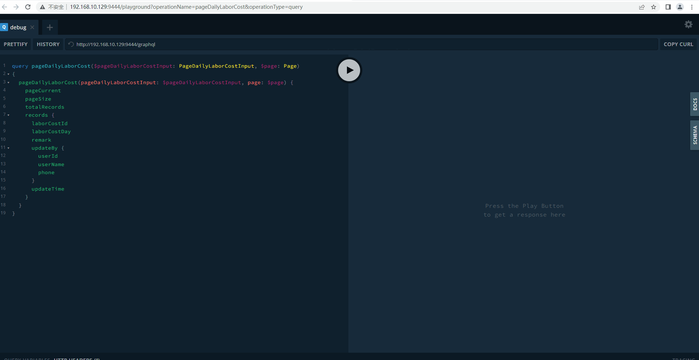

# 指令

## @mock

## enable

- Type: Boolean

- Locations: QUERY | MUTATION

如果设置且值为 true，则将模拟查询，否则查询将转发到后端。

示例：

```js
query customers($page: Page, $customersInput: CustomersInput)
@mock(enable: true) {
  customers(page: $page, customersInput: $customersInput) {
    records {
      customerId
      customerStatus
    }
    pageCurrent
    pageSize
    totalRecords
  }
}
```

## err

- Type: { code: Int!, message: String! }
- Locations: FIELD

如果设置，查询将响应包含您提供的错误的结果。

示例：

```js
query customers($page: Page, $customersInput: CustomersInput)
@mock(enable: true) {
  customers(page: $page, customersInput: $customersInput)
    @mock(err: { code: 500, message: "Internal error" }) {
    records {
      customerId
      customerStatus
    }
    pageCurrent
    pageSize
    totalRecords
  }
}
```

## len

- Type: String | Int

- Locations: FIELD

如果设置且字段为数组类型，则该字段的结果将是长度为 len 的数组。

示例：

```js
query customers($page: Page, $customersInput: CustomersInput)
@mock(enable: true) {
  customers(page: $page, customersInput: $customersInput) {
    records @mock(len: 10) {
      customerId
      customerStatus
    }
    pageCurrent
    pageSize
    totalRecords
  }
}
```

## val

- Type: String | Number | Boolean | Null

- Locations: FIELD

如果设置，此字段的结果将是您指定的值。

示例：

```js
query customers($page: Page, $customersInput: CustomersInput)
@mock(enable: true) {
  customers(page: $page, customersInput: $customersInput) {
    records @mock(len: 10) {
      customerId @mock(val: 1111)
      customerStatus
    }
    pageCurrent
    pageSize
    totalRecords
  }
}
```

## fallback

- Type: Boolean

- Locations: FIELD

有时，val 的值可能会导致验证/运行时错误，您可以通过将 fallback 设置为 true 来忽略该错误，然后结果将表现为未设置 val。请注意，如果错误是由 graphql 引发的，则不会生效。

示例：

```js
query customers($page: Page, $customersInput: CustomersInput)
@mock(enable: true) {
  customers(page: $page, customersInput: $customersInput) {
    records @mock(len: 10) {
      customerId @mock(val: {}, fallback: true)
      customerStatus
    }
    pageCurrent
    pageSize
    totalRecords
  }
}
```

## 使用示例


