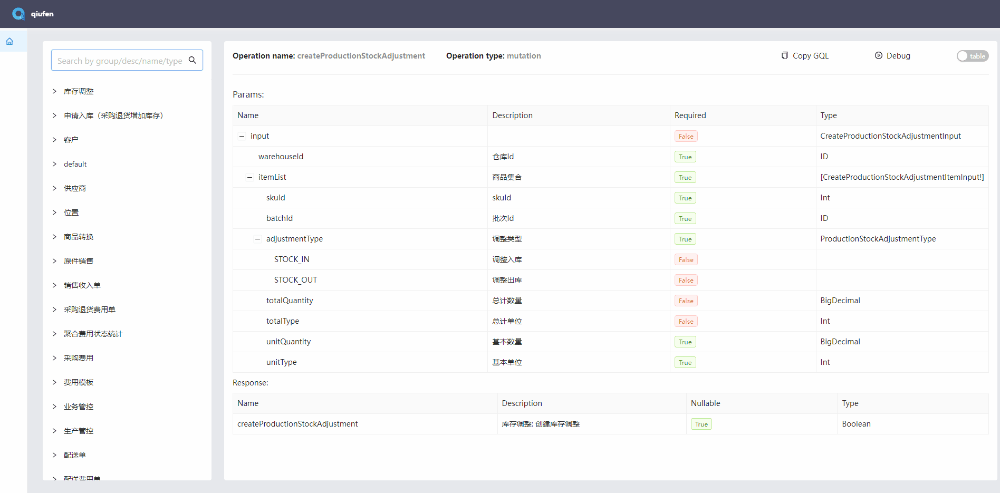

# 安装

npm 安装：

```bash
npm install @fruits-chain/qiufen-cli --save-dev
```

yarn 安装：

```bash
yarn add @fruits-chain/qiufen-cli --dev
```

# 用法

首先，您应该设置一个配置文件（详见下一节配置）：

```bash
yarn qiufen init
```

之后，您可以启动服务器：

```bash
yarn qiufen start
```

现在，您可以单击链接查看文档或将接口代理到模拟服务器。如下示例：


