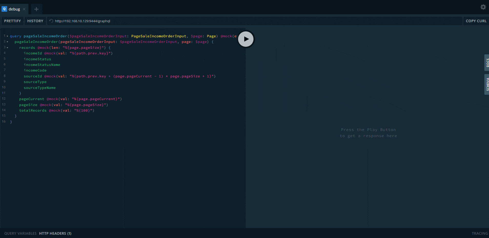

## 脚本

当指令值为 String 类型且匹配%{.\*}模板时，你可以获得这样的能力

示例：

document

```js
query customers($page: Page, $customersInput: CustomersInput)
@mock(enable: true) {
  customers(page: $page, customersInput: $customersInput) {
    records @mock(len: "%{page.pageSize}") {
      customerId
        @mock(
          val: "%{path.prev.key + (page.pageCurrent - 1) * page.pageSize + 1}"
        )
      customerStatus
    }
    pageCurrent @mock(val: "%{page.pageCurrent}")
    pageSize @mock(val: "%{page.pageSize}")
    totalRecords @mock(val: "%{100}")
  }
}
```

variables

```js
{
  "page": {
    "pageCurrent": 2,
    "pageSize": 5
  },
  "customersInput": {
    "keyword": "str",
    "attribute": "INTERNAL"
  }
}
```

response

```javascript
{
  "data": {
    "customers": {
      "records": [
        {
          "customerId": 6,
          "customerStatus": "SUSPENSION"
        },
        {
          "customerId": 7,
          "customerStatus": "RESIGN"
        },
        {
          "customerId": 8,
          "customerStatus": "SUSPENSION"
        },
        {
          "customerId": 9,
          "customerStatus": "RESIGN"
        },
        {
          "customerId": 10,
          "customerStatus": "NORMAL"
        }
      ],
      "pageCurrent": 2,
      "pageSize": 5,
      "totalRecords": 100
    }
  }
}
```

如您所见，查询可以响应与操作变量和一些特殊全局变量相关的结果。

## 全局变量

path

```javascript
interface Path {
  // parent field path
  readonly prev: Path | undefined
  // current field name
  readonly key: string | number
  // parent field type
  readonly typename: string | undefined
}
```

## 使用示例


